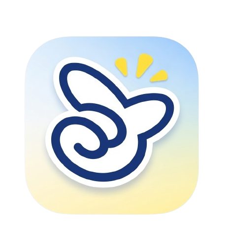

<div align="center">
  
  <br/>
  <br/>
  
  
  
  <br/>

  <h1 align="center">PRESTO: Marketplace de Services Locaux</h1>

  <p align="center">
    <strong>Une plateforme mobile et admin moderne conçue pour connecter les utilisateurs avec des experts prestataires de services de manière fluide et sécurisée.</strong>
  </p>
</div>

---

## Table des Matières

- [Aperçu du Projet](#-aperçu-du-projet)
- [Fonctionnalités Principales](#-fonctionnalités-principales)
  - [Module Administration](#️-module-administration)
  - [Applications Clients & Experts](#-applications-clients--experts)
- [Stack Technique](#-stack-technique)
- [Architecture du Code](#-architecture-du-code)
- [Prérequis](#-prérequis)
- [Installation & Configuration](#️-installation--configuration)

---

## Aperçu du Projet

**Marketplace Services Locaux** est une solution complète (SaaS-like) composée d'applications mobiles pour les clients et les prestataires, ainsi qu'un dashboard d'administration. Elle permet aux clients de rechercher facilement des services, de réserver des interventions, et aux experts de gérer leur activité professionnelle et leurs abonnements. Le dashboard admin offre une vue globale et un contrôle total sur l'écosystème.

---

## Fonctionnalités Principales

### Module Administration
Le dashboard d'administration est conçu pour offrir une expérience robuste et complète :
- **Dashboard Global** : Suivi des indicateurs clés (CA, nombre d'utilisateurs inscrits, croissance mensuelle).
- **Gestion des Utilisateurs & Prestataires** : Outils de validation, modération (Approuver / Rejeter), et gestion des rôles.
- **Suivi des Réservations** : Historique détaillé et statut en temps réel de toutes les interventions.
- **Gestion Financière** : Suivi des paiements, encaissements et gestion des abonnements (Packs Premium / Gratuit).
- **Centre de Support** : Gestion des avis clients et traitement des réclamations.
- **Statistiques Avancées** : Graphiques d'activité répartis par catégories avec filtrage dynamique.

### Applications Clients & Experts
- **Expérience Utilisateur Fluide** : Inscription simplifiée et profilage personnalisé.
- **Recherche Intelligente** : Découverte de services triés par catégorie, proximité et avis.
- **Système de Réservation** : Prise de rendez-vous intuitive avec système de confirmation et historique.
- **Profil Expert** : Interface dédiée aux prestataires pour mettre en valeur leur portfolio, leurs tarifs et leurs avis.

---

## Stack Technique

| Composant | Technologie | Description |
|-----------|-------------|-------------|
| **Frontend Mobile / Web** | [Flutter](https://flutter.dev/) | Framework UI cross-platform développé par Google. |
| **Langage** | [Dart](https://dart.dev/) | Utilisé avec Flutter pour un développement performant. |
| **Backend & Base de données** | [Firebase Firestore](https://firebase.google.com/products/firestore) | Base de données NoSQL hébergée et synchronisée en temps réel. |
| **Authentification** | [Firebase Auth](https://firebase.google.com/products/auth) | Gestion sécurisée par email/mot de passe et Google Sign-In. |
| **Stockage Fichiers** | [Firebase Storage](https://firebase.google.com/products/storage) | Hébergement et diffusion des images de profil, portfolios, etc. |

---

## Architecture du Code (`lib/`)

L'application suit une structure modulaire et scalable :

```text
lib/
├── screens/    # Interface Utilisateurs (Pages, Modales, Vues)
├── services/   # Logique métier et appels Firebase (Firestore, Auth, APIs)
├── layouts/    # Structures de pages réutilisables (Sidebars, Topbars, Navbars)
├── widgets/    # Composants UI élémentaires et réutilisables
├── models/     # Modèles de données typés (User, Provider, Intervention, etc.)
└── utils/      # Fonctions utilitaires, constantes et thèmes
```

---

## ⚙️ Prérequis

Assurez-vous d'avoir installé les outils suivants sur votre environnement de développement :
- [Flutter SDK](https://docs.flutter.dev/get-started/install) (dernière version stable recommandée)
- Un compte [Firebase](https://console.firebase.google.com/) actif
- Git
- Un émulateur iOS/Android ou un appareil physique

---

## Installation & Configuration

Suivez ces étapes pour exécuter le projet localement :

1. **Cloner le dépôt**
   ```bash
   git clone https://github.com/AmineElBiyadi/marketplace_services_app.git
   cd marketplace_services_app
   ```

2. **Accéder au dossier source**
   ```bash
   cd service_app
   ```

3. **Installer les dépendances Flutter**
   ```bash
   flutter pub get
   ```

4. **Configuration Firebase**
   - Le projet est déjà configuré avec Firebase. Vous n'avez pas besoin d'exécuter la CLI (`flutterfire`).
   - Si les fichiers de configuration ne sont pas inclus dans le dépôt, assurez-vous simplement d'ajouter le fichier `google-services.json` pour Android dans (`android/app/`) et `GoogleService-Info.plist` pour iOS dans (`ios/Runner/`).

5. **Exécuter l'application**
   ```bash
   flutter run
   ```

---

<div align="center">
  <sub>Développé avec ❤️ pour le projet Marketplace Services Locaux.</sub>
</div>
